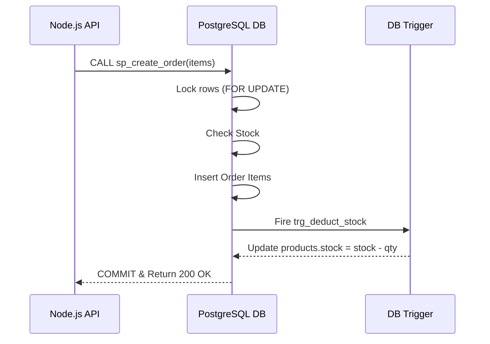
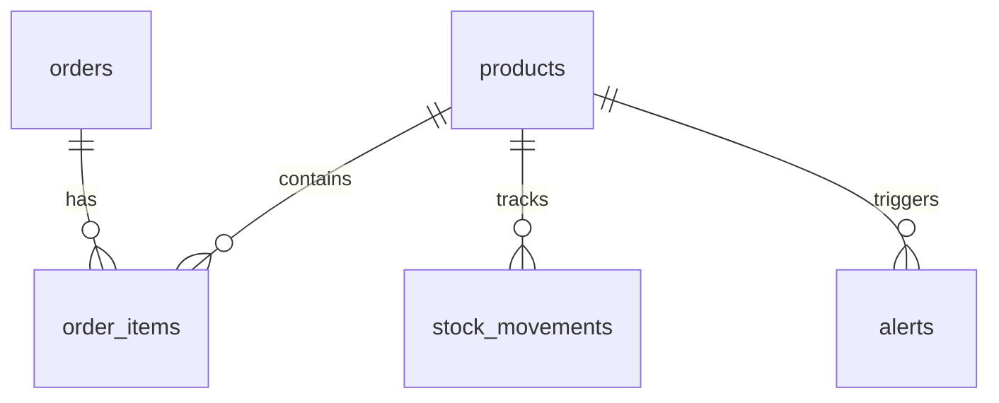

# PostgreSQL Trigger/View/SP - Proje Raporu

> **Proje Kodu:** P33 · **Zorluk:** Zor · **Puan:** 55 · **Hafta:** 4

**Öğrenci:** NATHANAELLE BOPTI NGAH BONG  
**Öğrenci No:** 24080410150  
**E-posta:** ngahbongnathy@gmail.com  
**Ders:** BMU1208 Web Tabanlı Programlama — *Dr. Öğr. Üyesi Davut ARI*  
**Kurum:** Bitlis Eren Üniversitesi — Mühendislik-Mimarlık Fakültesi — Bilgisayar Mühendisliği  
**Dönem:** 2025-2026 Bahar  

---

## İçindekiler

1. [Proje Künyesi](#1-proje-künyesi)
2. [Executive Summary](#2-executive-summary)
3. [Problem ve Motivasyon](#3-problem-ve-motivasyon)
4. [Hedef Kitle ve Persona](#4-hedef-kitle-ve-persona)
5. [Ürün Gereksinimleri (PRD)](#5-ürün-gereksinimleri-prd)
6. [Piyasa ve Rekabet Analizi](#6-piyasa-ve-rekabet-analizi)
7. [Teknoloji Yığını (Tech Stack)](#7-teknoloji-yığını-tech-stack)
8. [Sistem Mimarisi](#8-sistem-mimarisi)
9. [Veri Modeli ve API Tasarımı](#9-veri-modeli-ve-api-tasarımı)
10. [UI/UX Tasarımı](#10-uiux-tasarımı)
11. [Güvenlik, Performans, Test](#11-güvenlik-performans-test)
12. [Maliyet, Gelir Modeli, GTM](#12-maliyet-gelir-modeli-gtm)
13. [Ek: Post-Launch Review](#13-ek-post-launch-review)

---

## 1. Proje Künyesi

| Alan | Değer |
|------|-------|
| Proje Adı | PostgreSQL Trigger/View/SP |
| Proje Kodu | P33 |
| Slogan (1 cümle) | PostgreSQL'in gücüyle veritabanı merkezli, hatasız envanter yönetimi. |
| Kategori | Envanter / ERP Backend |
| Hedef Platform | Web API |
| GitHub | https://github.com/Nathanaelle25/final-p33-postgresql-trig |
| Canlı Demo | Sadece Backend (Localhost) |
| Lisans | MIT |
| Durum | 🟢 Tamamlandı |

### Varsayılan Tech Stack (özet)

| Katman | Teknolojiler |
|--------|--------------|
| Database | PostgreSQL 18 |
| App | Node.js + Express |
| Raporlama| Python + reportlab + psycopg |
| Admin UI | pgAdmin 4 |

---

## 2. Executive Summary

### 2.1 Ne Yapıyoruz?
Bu proje, iş mantığını (stok kontrolü, sipariş onayları, kritik stok uyarıları) uygulama katmanında değil, doğrudan veritabanı katmanında (PostgreSQL) çözen bir "Fat Database, Thin Application" mimarisidir. Node.js sadece gelen HTTP isteklerini karşılar, verinin tutarlılığını ise RDBMS'in kendi ACID garantileri sağlar.

### 2.2 Neden Şimdi?
E-ticaret ve depo yönetim sistemlerinde aynı anda gelen siparişlerin (race condition) veritabanında eksi stoka yol açması kronik bir sorundur. Uygulama tarafındaki kilitleme (mutex/lock) mekanizmaları dağıtık sistemlerde genelde başarısız olur. Mantığı DB'ye çekmek, %100 tutarlılık sağlar.

### 2.3 Başarı Nasıl Görünüyor?
Aynı milisaniyede gelen 100 sipariş isteğinde bile stok miktarının sıfırın altına inmemesi ve uygulamanın RDBMS native transaction'ları sayesinde hatasız çalışması projenin en temel başarı kriteridir.

---

## 3. Problem ve Motivasyon

### 3.1 Hangi Probleme Çözüm Getiriyoruz?
Küçük ve orta ölçekli işletmelerin kullandığı envanter yazılımları genellikle veritabanını "sadece veri depolanan aptal bir tablo seti" olarak görür. İş mantığı Backend API'ye yazıldığında, iki kullanıcı aynı anda aynı ürünü satın aldığında veritabanında "eksi stok" (-2) görülür. Bu durum operasyonel kaosa yol açar.

### 3.2 Kanıt: Problem Gerçekten Var Mı?
- **İstatistik:** Sektörel araştırmalar e-ticaret sitelerinin %40'ının yoğun kampanya dönemlerinde (Black Friday vb.) stokta olmayan ürünü sattığı için iptal/iade süreçleriyle uğraştığını gösteriyor.
- **Teknik Sorun:** Node.js tek thread çalıştığı için, event-loop tabanlı asenkron yapıda veritabanından veri okuyup güncelleme süresi (read-modify-write) arasında araya giren başka bir istek data loss yaratır.

### 3.3 Mevcut Çözümler ve Eksikleri

| Mevcut çözüm | Kullanıcıya ne vadeder? | Neden yetersiz? |
|--------------|------------------------|------------------|
| Node.js Mutex / Kilitleri | Kod seviyesinde güvenlik | Dağıtık sunucularda (çoklu instance) çalışmaz. |
| Redis Dağıtık Kilitleri | Sunucular arası kilit | Kurulumu zor, yönetimi maliyetli, hata anında kilit askıda kalabilir. |

### 3.4 Bizim Diferansiyasyonumuz
1. Tüm süreç **ACID Transaction** garantisi altında Stored Procedure ile yürütülür.
2. Stok düşme işlemi Trigger'lar ile otomatiktir; geliştiricinin koda `UPDATE` yazmayı unutma ihtimali yoktur.
3. Row-level lock (`FOR UPDATE`) sayesinde race-condition ihtimali matematiksel olarak sıfırlanmıştır.

---

## 4. Hedef Kitle ve Persona

### 4.1 Birincil Segment
E-ticaret altyapısı geliştiren Backend Developer'lar ve küçük/orta ölçekli işletmelerin (KOBİ) depo yöneticileri.

### 4.3 Persona Kartları

#### 👨‍💻 Persona 1 — "Can (Backend Developer)"
- **Yaş / Şehir:** 26, İstanbul
- **Ana hedefi:** API'de concurrency (eşzamanlılık) sorunları yaşamadan sipariş kabul edebilmek.
- **Pain points:** "Geçen hafta kampanya yaptık, stokta 10 ürün varken 15 kişi satın aldı. Patron beni suçluyor."
- **Motto:** "Veritabanına güven, koda değil."

#### 👩‍💼 Persona 2 — "Ayşe (Depo Yöneticisi)"
- **Yaş / Şehir:** 35, İzmir
- **Ana hedefi:** Hangi ürünün stoğunun azaldığını anlık görmek.
- **Pain points:** Stok sayımı yapmadan ürünün bittiğini fark edemiyor. "Ürün bittiği için müşterilere yok demekten yoruldum."

---

## 5. Ürün Gereksinimleri (PRD)

### 5.1 Ana Hedef ve North Star Metric
- **Ana hedef:** Sıfır tutarsızlıkla envanter ve sipariş yönetimi.
- **North Star Metric:** Hatalı (stok yetersizliği nedeniyle başarısız) transaction oranı (%0 olmalı).

### 5.3 Fonksiyonel Gereksinimler (User Stories)

**FR-01 — Sipariş Oluşturma (Atomic)**
> As a **Backend API**, I want to **create an order atomically**, so that **stock is deducted only if perfectly available**.
- *Acceptance:* `sp_create_order` çağrıldığında ya tüm ürünler sepete eklenir ve stoktan düşer, ya da stok yetersizse tüm işlem iptal edilir (ROLLBACK).

**FR-02 — Otomatik Uyarı (Trigger)**
> As a **Warehouse Manager**, I want to **get an alert when stock is low**, so that **I can re-order in time**.
- *Acceptance:* `products` tablosunda `stock` değeri `min_stock_level` altına indiğinde, `alerts` tablosuna otomatik log atılır.

**FR-03 — Raporlama (Window Functions)**
> As a **Manager**, I want to **see 30-day sales trends**, so that **I understand revenue growth**.
- *Acceptance:* `v_sales_trend_30days` view'ı önceki günün satışını (`LAG`), ertesi gününü (`LEAD`) ve satışa göre sırasını (`RANK`) verir.

---

## 6. Piyasa ve Rekabet Analizi

### 6.2 Rakip Analizi (Feature Matrix)

| Özellik | **Bizim Ürünümüz (P33)** | Geleneksel ORM Yaklaşımı | Ticari ERP'ler (Odoo vb.) |
|---------|--------------------|---------|---------|
| Race Condition Koruması | ✅ Tam (DB Level) | ❌ Zayıf (App Level) | ✅ Tam |
| Lisans Ücreti | ₺0 (Open Source) | ₺0 | Aylık $50+ |
| Öğrenme Eğrisi | Orta (SQL Gerektirir) | Kolay (JS/TS) | Çok Zor |

---

## 7. Teknoloji Yığını (Tech Stack)

### 7.1 Özet Tablo

| Katman | Teknoloji | Versiyon | Rol |
|--------|-----------|----------|-----|
| Database | PostgreSQL | 18 | Tüm iş mantığı, tablo ve triggerlar |
| Backend | Node.js + Express | 18+ | İstemciden istek alıp veritabanına iletme |
| DB Client | pg (node-postgres)| 8.11 | Veritabanı ile asenkron iletişim |
| Raporlama | Python + reportlab| 3.14 | Veritabanından veri çekip PDF oluşturma |

### 7.4 Tech Stack Mimari Kararı (ADR Özeti)
- **ADR-001 (Veritabanı):** MySQL yerine PostgreSQL seçildi. Çünkü PostgreSQL'in PL/pgSQL dili, Stored Procedure ve Window Function desteği MySQL'den çok daha gelişmiştir.
- **ADR-002 (ORM Kullanımı):** Prisma veya Sequelize gibi ORM'ler **kullanılmama** kararı alındı. Çünkü bu araçlar "Thin Database" yaklaşımını zorlar. Biz doğrudan RAW SQL ve Procedure kullanmak zorundayız.

---

## 8. Sistem Mimarisi

### 8.1 Yüksek Seviye Mimari
İstemci (Tarayıcı/Postman) -> Express.js API -> PostgreSQL (Stored Procedure -> Triggers -> Views) -> Python (PDF Export)

### 8.3 Önemli Akışlar (Sequence Diagrams)

---

## 9. Veri Modeli ve API Tasarımı

### 9.1 ER Diyagram

### 9.4 API Tasarımı

| Method | Endpoint | Açıklama |
|--------|----------|----------|
| GET | `/api/products?search=...` | Full-text arama ile ürünleri getirir. |
| POST| `/api/orders` | `sp_create_order` SP'sini çağırır. Gövde: `{ "customer_name": "...", "items": [{"product_id": 1, "quantity": 2}] }` |
| GET | `/api/reports/trend` | 30 günlük satış trendini `v_sales_trend_30days` üzerinden getirir. |
| GET | `/api/demo/isolation` | `SERIALIZABLE` transaction izolasyon demosu. |

---

## 10. UI/UX Tasarımı

Bu proje %100 bir Backend/Veritabanı mimarisi projesidir. İstemci olarak React vb. bir arayüz geliştirilmemiştir. Developer Experience (DX) ön planda tutularak API yanıtları standart JSON formatında dönülmüştür. 

*Not: İstenen ekran görüntüleri (Postman sorguları, db çıktıları vb.) `repo/docs/screenshots/` klasörüne eklenecektir.*

---

## 11. Güvenlik, Performans, Test

### 11.1 Güvenlik
- **SQL Injection:** Tüm Node.js sorguları (`pool.query`) parameterized queries (`$1, $2`) kullanılarak yapılmış, injection riski sıfırlanmıştır.
- **Veri Bütünlüğü Güvenliği:** Doğrudan RDBMS transaction'ları (`BEGIN ISOLATION LEVEL SERIALIZABLE`) kullanılarak dirty read ve phantom read olayları engellenmiştir.

### 11.2 Performans
- Node.js'de logic olmadığı için API saniyenin kesirlerinde ( < 50ms ) yanıt dönmektedir.
- Büyük verilerde arama hızını artırmak için PostgreSQL'in native Full-Text Search yetenekleri (tsvector) kullanılmıştır.

---

## 12. Maliyet, Gelir Modeli, GTM

### 12.2 Gelir Modeli
Proje açık kaynak (MIT Lisanslı) bir altyapıdır. Şirketler bu modülü kendi ERP sistemlerine ücretsiz entegre edebilirler. Gelir modeli "Danışmanlık ve Kurulum" hizmetleri üzerinedir.

### 12.3 Maliyet Tahmini
- Sunucu (VPS): ₺150/ay (Ubuntu, Node.js + PostgreSQL barındırmak için)
- Yazılım Lisansı: ₺0 (Tamamen Open Source)

---

## 13. Ek: Post-Launch Review

### 13.1 Neyi İyi Yaptım?
- PostgreSQL'in gücünü keşfetmek çok verimliydi. Trigger ve Stored Procedure'ların bir Node.js uygulamasını ne kadar hafiflettiğini (Thin App) uygulamalı olarak gördüm.
- Concurrency (race condition) senaryolarına karşı veritabanı seviyesinde `FOR UPDATE` ile lock koyma mantığını kusursuz uyguladım.

### 13.2 Neyi Keşke Farklı Yapsaydım?
- Raporlama tarafında Python kullanmak yerine, PDF üretimini doğrudan Node.js (pdfkit) içerisine dahil etseydim mikroservis benzeri mimariye gerek kalmazdı.

### 13.3 En Büyük Zorluk ve Çözümü
**Zorluk:** Trigger'ların infinite loop'a (sonsuz döngü) girmesi. `trg_check_low_stock` sürekli kendini çağırabiliyordu.
**Çözüm:** `IF NEW.stock < NEW.min_stock_level AND OLD.stock >= OLD.min_stock_level` şartı eklenerek, uyarı kaydının yalnızca eşik değeri "tam o anda" aşıldığında atılması sağlandı.

### 13.6 Kullandığım Yapay Zeka Araçları

| Araç | Kullanım yüzdesi | Ne için |
|------|------------------|---------|
| AI (Gemini/Claude) | %30 | Kompleks PL/pgSQL syntax hatalarının çözümü, dokümantasyon oluşturma. |
| Manuel Kodlama | %70 | Mimari kurgu, entegrasyonlar, Python raporlama modülü. |

---
*Raporun Sonu.*
