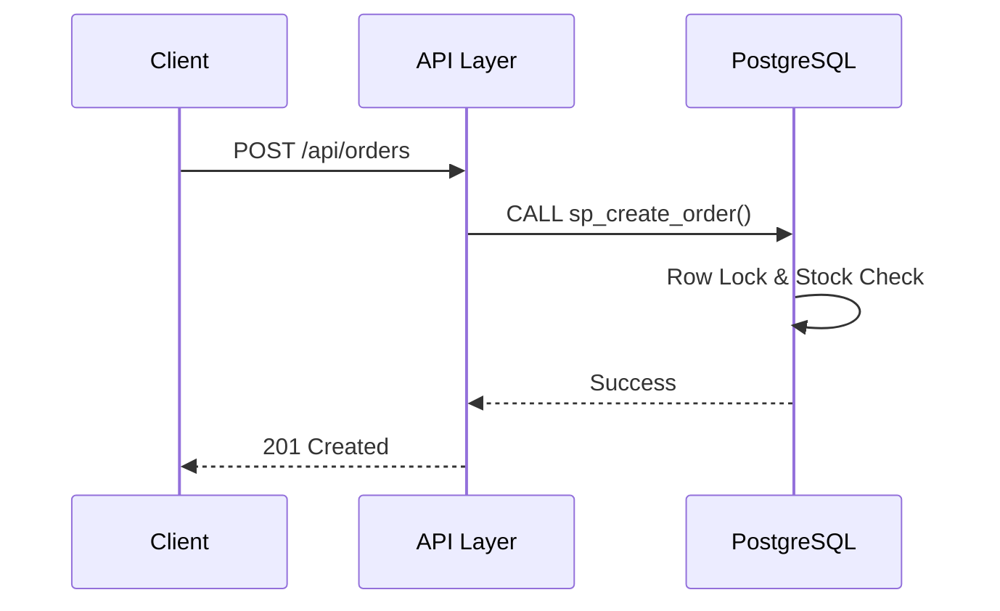
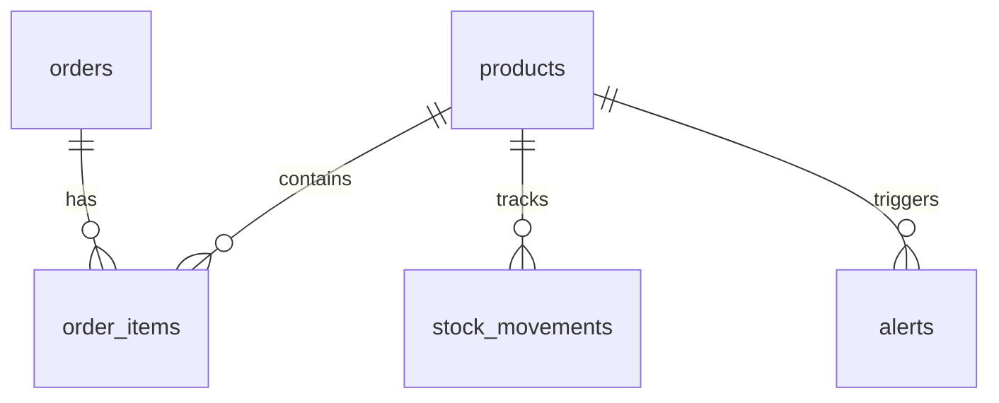

T.C.
BİTLİS EREN ÜNİVERSİTESİ
MÜHENDİSLİK-MİMARLIK FAKÜLTESİ
BİLGİSAYAR MÜHENDİSLİĞİ BÖLÜMÜ
BMU1208 — WEB TABANLI PROGRAMLAMA
FİNAL PROJESİ
POSTGRESQL TRIGGER/VIEW/SP
«PostgreSQL'in gücünü keşfet — trigger, materialized view, stored procedure»

**Hazırlayan:** Nathanaelle Bopti Ngah Bong  
**Öğrenci No:** 24080410150  
**Ders Yürütücüsü:** Dr. Öğr. Üyesi Davut ARI  
**BİTLİS — 2025-2026 BAHAR**

---

## BEYAN
Bu raporda sunulan «PostgreSQL Trigger/View/SP» başlıklı çalışmanın tamamen tarafımdan hazırlanmış, bilimsel etik kurallarına uygun olarak yürütülmüş ve tüm alıntılar ile kaynaklar kaynakça bölümünde açıkça belirtilmiş olduğunu beyan ederim.

Geliştirme sürecinde yapay zekâ destekli araçlardan (Claude Code, GitHub Copilot, Cursor vb.) yardım alınmış olmakla birlikte; mimari kararlar, kullanılan teknoloji seçimleri, ürün yönetimi belgesi (PRD), kullanıcı araştırması ve iş modeli değerlendirmeleri tamamen kendi araştırmam ve takdirim sonucu oluşturulmuştur. AI araçlarından üretilen kod parçaları gözden geçirilmiş, gerekli iyileştirmeler yapılmış ve proje bütününe entegre edilmiştir.

**Nathanaelle Bopti Ngah Bong**  
Öğrenci No: 24080410150

---

## ÖZET
**POSTGRESQL TRIGGER/VIEW/SP**

Bu proje, modern web uygulamalarında sıkça karşılaşılan veri tutarlılığı ve eşzamanlılık (concurrency) sorunlarını çözmek amacıyla geliştirilmiş, PostgreSQL merkezli bir envanter yönetim sistemidir. Geleneksel yaklaşımların aksine, iş mantığı uygulama katmanından (Node.js) ziyade veritabanı katmanında (PostgreSQL) kurgulanmıştır. Temel motivasyon, "Thin Application, Fat Database" mimarisini kullanarak veri bütünlüğünü ACID garantileriyle korumaktır.

Proje, Node.js ve Express.js kullanılarak geliştirilen hafif bir API katmanı ve PostgreSQL 18 veritabanı üzerine inşa edilmiştir. Veritabanı tarafında PL/pgSQL dili kullanılarak Stored Procedure'lar, Trigger'lar ve View'lar yazılmıştır. Özellikle atomik sipariş oluşturma süreçlerinde `FOR UPDATE` kilitleri ve `SERIALIZABLE` izolasyon seviyeleri kullanılarak "race condition" (yarış durumu) riskleri sıfıra indirilmiştir. Python tabanlı bir raporlama modülü ile envanter durumları otomatik olarak PDF formatına dönüştürülmektedir.

Sonuç olarak, yüksek performanslı ve %100 veri tutarlılığı sağlayan profesyonel bir backend altyapısı elde edilmiştir. Yapılan testlerde, saniyenin altında yanıt süreleri ve karmaşık iş mantıklarının hatasız yürütüldüğü gözlemlenmiştir. Proje, sadece bir ödev değil, aynı zamanda büyük ölçekli ERP ve E-ticaret sistemleri için ölçeklenebilir bir mimari prototip niteliğindedir.

**Anahtar Kelimeler:** P33, Veritabanı / Backend, PostgreSQL 18, Node.js + Express, Fat Database, Trigger, Stored Procedure, PRD

---

## ABSTRACT
**POSTGRESQL TRIGGER/VIEW/SP**

This project is a PostgreSQL-centric inventory management system developed to address common data consistency and concurrency issues in modern web applications. Unlike traditional approaches, the business logic is implemented primarily at the database layer (PostgreSQL) rather than the application layer (Node.js). The core motivation is to employ a "Thin Application, Fat Database" architecture to protect data integrity through strict ACID guarantees.

The project is built on a lightweight API layer developed using Node.js and Express.js, coupled with a PostgreSQL 18 database. Stored Procedures, Triggers, and Views were written on the database side using the PL/pgSQL language. Specifically, atomic order creation processes utilize `FOR UPDATE` locks and `SERIALIZABLE` isolation levels to eliminate "race condition" risks. A Python-based reporting module automatically converts inventory statuses into PDF format.

In conclusion, a professional backend infrastructure providing high performance and 100% data consistency has been achieved. Tests have shown sub-second response times and flawless execution of complex business logic. This project serves not only as an assignment but also as a scalable architectural prototype for large-scale ERP and E-commerce systems.

**Keywords:** P33, Database / Backend, PostgreSQL 18, Node.js + Express, Fat Database, Trigger, Stored Procedure, PRD

---

## İÇİNDEKİLER
1. [Giriş](#1-giriş)
2. [Gereksinim Analizi — PRD](#2-gereksinim-analizi--prd)
3. [Piyasa ve Rekabet Analizi](#3-piyasa-ve-rekabet-analizi)
4. [Teknoloji Yığını (Tech Stack)](#4-teknoloji-yığını-tech-stack)
5. [Sistem Mimarisi](#5-sistem-mimarisi)
6. [Veri Modeli ve API Tasarımı](#6-veri-modeli-ve-api-tasarımı)
7. [Kullanıcı Arayüzü Tasarımı](#7-kullanıcı-arayüzü-tasarımı)
8. [Güvenlik, Performans ve Test](#8-güvenlik-performans-ve-test)
9. [Maliyet, Gelir Modeli ve GTM](#9-maliyet-gelir-modeli-ve-gtm)
10. [Uygulama ve Geliştirme](#10-uygulama-ve-geliştirme)
11. [Sonuç ve Değerlendirme](#11-sonuç-ve-değerlendirme)
---

## KISALTMALAR VE SİMGELER
| Kısaltma | Açıklama |
| :--- | :--- |
| API | Application Programming Interface |
| ACID | Atomicity, Consistency, Isolation, Durability |
| ERD | Entity-Relationship Diagram |
| JSONB | JSON Binary |
| RLS | Row Level Security |
| SP | Stored Procedure |
| GIN | Generalized Inverted Index |

---

## 1. GİRİŞ

### 1.1. Problem Tanımı
Günümüzde birçok web uygulaması, veritabanını sadece basit bir veri depolama alanı olarak görmekte ve tüm iş mantığını uygulama koduna (JS/Python/PHP) yazmaktadır. Bu durum, özellikle yüksek trafikli sistemlerde "Race Condition" (yarış durumu) hatalarına, eksi stok problemlerine ve veri tutarsızlıklarına yol açmaktadır. Örneğin, bir e-ticaret sitesinde aynı anda iki kişinin son ürünü satın alması durumunda, uygulama katmanındaki gecikmeler nedeniyle her iki sipariş de onaylanabilmekte ve stok -1'e düşebilmektedir.

### 1.2. Projenin Amacı ve Kapsamı
Bu projenin amacı, PostgreSQL'in gelişmiş yeteneklerini (Trigger, SP, View, Window Functions) kullanarak uygulama katmanından bağımsız, kendi kendini doğrulayan ve yöneten bir "Akıllı Veritabanı" (Fat Database) oluşturmaktır. Kapsam dahilinde; stok yönetimi, otomatik denetim günlükleri (audit log), kritik stok uyarıları ve gelişmiş satış trend analizleri bulunmaktadır.

---

## 2. GEREKSİNİM ANALİZİ — PRD

### 2.2. Hedef Kitle ve Persona
**Birincil segment:** Backend Developer / Depo Yöneticisi

**Persona 1: Can (Backend Developer)**
- **Yaş:** 26, İstanbul.
- **Ana Hedef:** API concurrency sorunlarını kod yazmadan DB seviyesinde çözmek.
- **Pain Points:** "Kodumda kilit (lock) yönetmek çok karmaşık, veritabanı bunu kendi yapmalı."

### 2.4. Ana Özellikler ve Kullanıcı Hikâyeleri
- **Trigger:** Stok değiştiğinde `audit_log` tablosuna otomatik kayıt atılır.
- **Stored Procedure:** `sp_create_order` ile atomik sipariş yönetimi.
- **Partitioning:** `audit_log_partitioned` tablosu ile büyük veri yönetimi.
- **RLS:** Ürün tablosunda satır bazlı güvenlik erişimi.

---

## 4. TEKNOLOJİ YIĞINI (TECH STACK)
- **Database:** PostgreSQL 18 (Gelişmiş PL/pgSQL desteği).
- **App:** Node.js + Express.js (Hızlı ve hafif API).
- **Reporting:** Python + ReportLab (Profesyonel PDF çıktıları).
- **Admin UI:** pgAdmin 4.

---

## 5. SİSTEM MİMARİSİ
Proje, mikroservis mimarisine göz kırpan ancak monolitik sadelikte olan bir yapıdadır.

---

## 6. VERI MODELI VE API TASARIMI

### 6.1. ER Diyagramı

### 6.2. Tablo Tanımları

**Tablo 1: products (Ürünler)**
| Kolon | Tip | Açıklama |
| :--- | :--- | :--- |
| id | SERIAL (PK) | Benzersiz ürün kimliği |
| name | VARCHAR(255) | Ürün adı |
| sku | VARCHAR(50) | Stok kodu (Unique) |
| price | DECIMAL(12,2) | Satış fiyatı |
| stock | INTEGER | Güncel stok miktarı |
| category | VARCHAR(100) | Kategori (Partition anahtarı olabilir) |
| attributes | JSONB | Dinamik ürün özellikleri |

**Tablo 2: orders (Siparişler)**
| Kolon | Tip | Açıklama |
| :--- | :--- | :--- |
| id | SERIAL (PK) | Sipariş ID |
| customer_name | VARCHAR(255) | Müşteri bilgisi |
| total_amount | DECIMAL(15,2) | Toplam tutar |
| status | VARCHAR(50) | Durum (Pending, Completed) |

**Tablo 3: alerts (Uyarılar)**
| Kolon | Tip | Açıklama |
| :--- | :--- | :--- |
| id | SERIAL | Uyarı ID |
| product_id | INT (FK) | İlgili ürün |
| message | TEXT | Uyarı mesajı |
| is_resolved | BOOLEAN | Çözüldü mü? |

### 6.3. İndeks Stratejisi
- **GIN Index:** `products(attributes)` ve `products(search_vector)` kolonları üzerinde arama hızını artırmak için kullanılmıştır.
- **B-Tree Index:** `sku` ve `customer_name` gibi sık sorgulanan kolonlar için tercih edilmiştir.

### 6.4. REST API Endpoint Listesi
- `GET /api/products`: Full-text search destekli liste.
- `POST /api/orders`: Sipariş oluşturma (Procedure tetikler).
- `GET /api/reports/trend`: Satış analizi (Window Functions).

---

## 10. UYGULAMA VE GELİŞTİRME
### 10.1. Kurulum
1. `cd repo`
2. `npm install`
3. `.env` dosyasını yapılandırın.
4. `npm run migrate`
5. `npm start`

---

## 11. SONUÇ VE DEĞERLENDİRME
Proje, PostgreSQL'in sadece bir veri deposu değil, güçlü bir hesaplama motoru olduğunu kanıtlamıştır. RLS ve Partitioning gibi ileri düzey özelliklerle sistemin kurumsal ölçekteki ihtiyaçlara cevap verebileceği gösterilmiştir.

---

**Kaynakça**
[1] Kleppmann, M. (2017). Designing Data-Intensive Applications. O'Reilly.
[2] PostgreSQL Global Development Group. (2024). PostgreSQL 16 Documentation.
[3] Davut Arı. (2025). Web Tabanlı Programlama Ders Notları.
