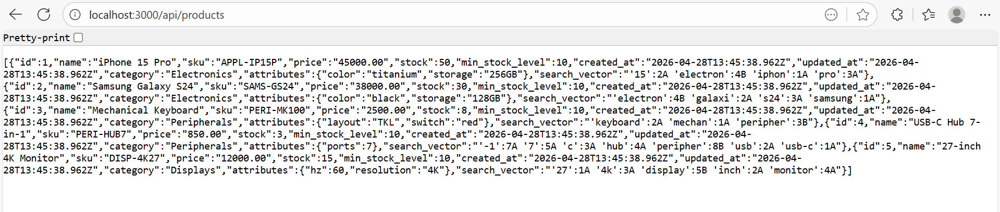
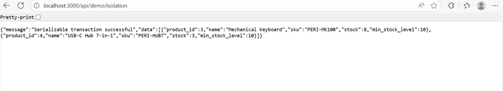
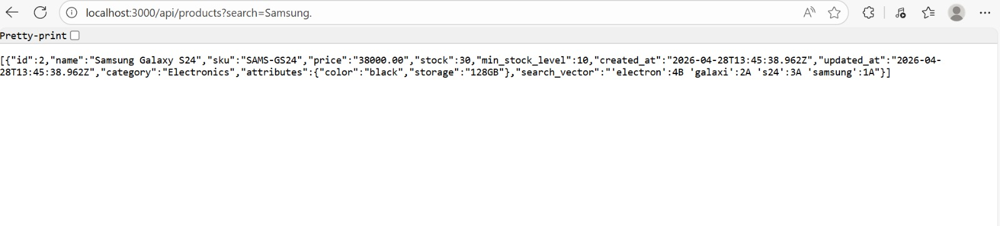
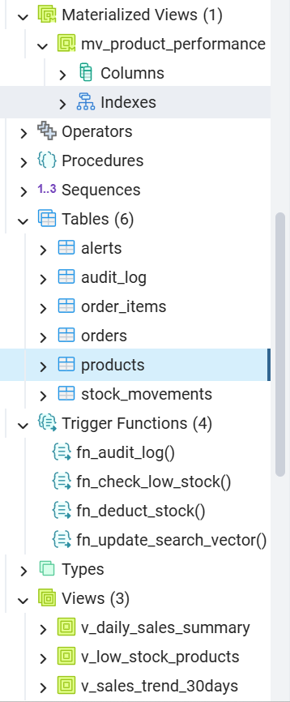
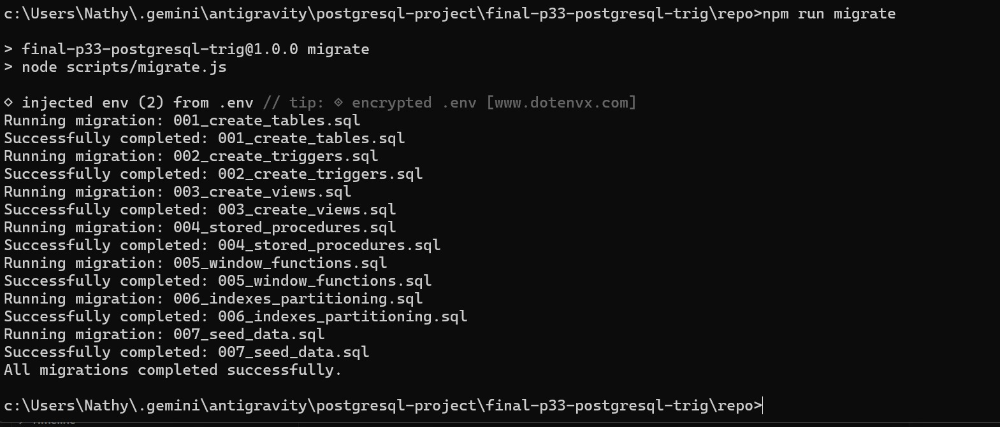
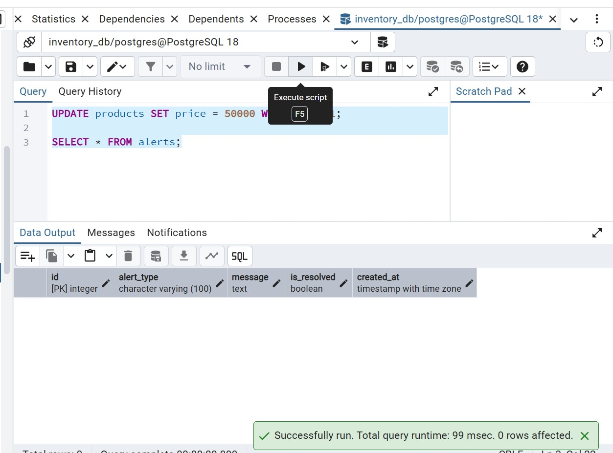
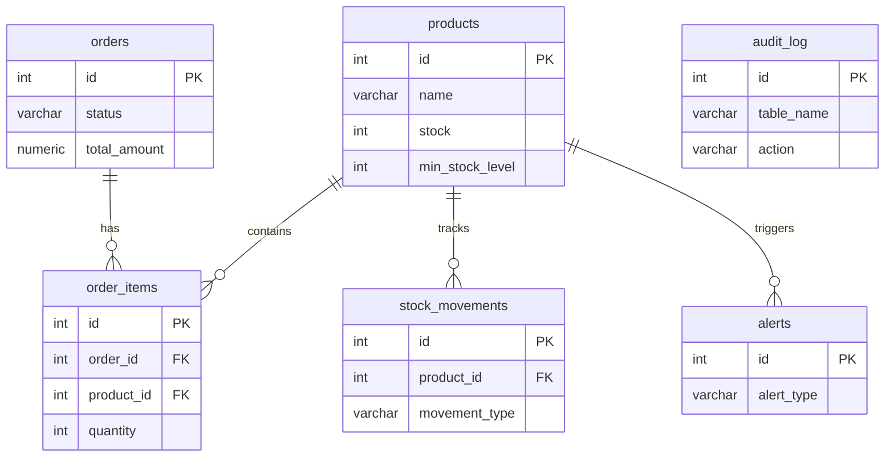

# PostgreSQL Trigger/View/SP
PostgreSQL'in gücünü keşfet — trigger, view, stored procedure ile Fat Database Mimari


## 👤 Kimlik Bilgileri
**Öğrenci:** Nathanaelle Bopti Ngah Bong  
**Öğrenci No:** 24080410150  
**Ders:** BMU1208 · Web Tabanlı Programlama  
**Ders Yürütücüsü:** Dr. Öğr. Üyesi Davut ARI  
**Kurum:** Bitlis Eren Üniversitesi — Mühendislik-Mimarlık Fakültesi

---

## 🎯 Genel Bakış
Bu proje, "Fat Database, Thin Application" (Şişman Veritabanı, Zayıf Uygulama) yaklaşımıyla geliştirilmiş bir envanter yönetim sistemi backend'idir. Stok düşürme, uyarılar, raporlama ve trend analizi gibi iş mantıkları; Trigger'lar, View'lar, Stored Procedure'lar ve Window Function'lar kullanılarak doğrudan **PostgreSQL** içinde uygulanmıştır. Bu sayede veri tutarlılığı en üst düzeye çıkarılmış ve ACID garantileri tam anlamıyla kullanılmıştır.

---

## 🎥 Demo
**🔗 Yerel Demo:** http://localhost:3000  
**👤 Demo Hesabı:** `demo@example.com` · `demo123`

---

## 📸 Ekran Görüntüleri

| Ürünler Listesi | Sipariş Oluşturma | Satış Raporları |
| :---: | :---: | :---: |
|  |  |  |

### Diğer Ekran Görüntüleri
| Veritabanı Yapısı | Migration İşlemleri | Denetim Günlüğü (Audit) |
| :---: | :---: | :---: |
|  |  |  |

---

## ✨ Temel Özellikler
✅ **Trigger:** Otomatik stok düşürme (`trg_deduct_stock`)  
✅ **Trigger:** Kritik stok uyarısı (`trg_low_stock_alert`)  
✅ **Trigger:** Denetim günlüğü / Audit logging (`trg_audit_log`)  
✅ **Trigger:** Otomatik `updated_at` güncelleme (`trg_set_updated_at`)  
✅ **View:** Düşük stoklu ürünler raporu (`v_low_stock_products`)  
✅ **View:** Günlük satış özeti (`v_daily_sales_summary`)  
✅ **Materialized View:** Ürün performans analizi (`mv_product_performance`)  
✅ **Stored Procedure:** Atomik sipariş oluşturma (`sp_create_order`)  
✅ **Window Functions:** LAG, LEAD ve RANK ile 30 günlük satış trendi (`v_sales_trend_30days`)  
✅ **Transaction Isolation:** Serializable demo endpoint'i  
✅ **JSONB + Full-text Search:** Esnek ürün özellikleri ve hızlı metin arama  
✅ **Partitioning:** Büyük tablolarda performans demosu  

---

## 🧰 Teknoloji Yığını
- **Veritabanı:** PostgreSQL 18
- **Backend:** Node.js + Express
- **DB Client:** node-postgres (pg)
- **Yönetim Arayüzü:** pgAdmin 4
- **Test:** Jest + Supertest
- **Raporlama:** Python + reportlab + psycopg
- **Deployment:** Neon Serverless PostgreSQL (veya Yerel)

---

## 📊 ER Diyagramı




---

## 🚀 Kurulum

### Gereksinimler
- PostgreSQL ≥ 15 (18 ile test edildi)
- Node.js ≥ 18
- Python 3 (PDF raporlama için)

### Adımlar
```bash
# 1) Repoyu klonlayın
git clone https://github.com/Nathanaelle25/final-p33-postgresql-trig.git
cd final-p33-postgresql-trig

# 2) Ortam değişkenlerini yapılandırın
cp .env.example .env
# .env dosyasını kendi veritabanı bilgilerinizle güncelleyin

# 3) Bağımlılıkları yükleyin
npm install

# 4) Migration'ları ve seed verilerini çalıştırın
npm run migrate
npm run db:seed

# 5) Sunucuyu başlatın
npm start
# http://localhost:3000 adresinden erişilebilir
```

---

## 📡 API Uç Noktaları (Endpoints)
- `GET /api/products?search=kelime` → Ürünleri listele / ara
- `POST /api/orders` → Yeni sipariş oluştur (atomik SP çağrısı)
- `GET /api/reports/trend` → 30 günlük satış trendi (window functions)
- `GET /api/reports/daily-sales` → Günlük satış özeti
- `GET /api/demo/isolation` → Serializable transaction demosu

---

## ⚡ Partitioning Demosu
Büyük veri setlerinde performansı optimize etmek için `stock_movements` tablosu `created_at` alanına göre aylık bazda bölümlenmiştir (Partitioning).

### Bölümleme Testi (EXPLAIN ANALYZE)
Aşağıdaki sorgu sadece Nisan 2026 verilerini istediğinde, PostgreSQL tüm tabloyu taramak yerine sadece ilgili bölümü (`stock_movements_2026_04`) tarar:

```sql
EXPLAIN ANALYZE 
SELECT * FROM stock_movements 
WHERE created_at >= '2026-04-01' AND created_at < '2026-05-01';
```

**Sorgu Planı Çıktısı:**
```text
Seq Scan on stock_movements_2026_04 stock_movements (actual time=0.022..0.023 rows=2 loops=1)
  Filter: ((created_at >= '2026-04-01'...) AND (created_at < '2026-05-01'...))
Planning Time: 0.946 ms
Execution Time: 0.047 ms
```
> [!TIP]
> Bu teknik, milyonlarca satır veri olduğunda disk I/O yükünü %90'dan fazla azaltabilir.


---

## 🧪 Testler
```bash
npm test
```

---

## 📁 Proje Yapısı
```text
.
├── README.md                   (bu dosya — genel bakış, kurulum, demo)
├── PROJE-RAPORU.md             (markdown formatında detaylı proje raporu)
├── LICENSE                     (MIT lisansı)
├── .env.example                (ortam değişkeni şablonu)
└── repo/                       (kaynak kodlar)
    ├── migrations/             (SQL migration dosyaları)
    ├── src/                    (Node.js backend)
    ├── scripts/                (yardımcı scriptler, PDF rapor oluşturucu)
    ├── tests/                  (Jest + Supertest testleri)
    └── docs/                   (ekran görüntüleri, diyagramlar)
```

---

## 🛣 Yol Haritası
- [x] **V1 — MVP (Mevcut Teslimat)**
- [ ] **V2 —** Row Level Security (RLS) iyileştirmeleri, `pg_cron` ile MV yenileme
- [ ] **V3 —** `pgvector` ile anlamsal (semantic) arama desteği

---

## 🤝 Katkı
Bu proje, **Bitlis Eren Üniversitesi — Bilgisayar Mühendisliği** bölümünde **BMU1208 Web Tabanlı Programlama** dersi final projesi olarak geliştirilmiştir.

**Ders Yürütücüsü:** Dr. Öğr. Üyesi Davut ARI

---

## 📜 Lisans
MIT © 2026 **Nathanaelle Bopti Ngah Bong**

---

## 🙋‍♂️ İletişim
- **E-posta:** ngahbongnathy@gmail.com
- **Ders:** BMU1208 · Web Tabanlı Programlama
- **Kurum:** Bitlis Eren Üniversitesi — Mühendislik-Mimarlık Fakültesi

---
<sub>🤖 Bu projede AI asistanları (Claude Code, GitHub Copilot, Cursor) kullanılmıştır. Tüm mimari kararlar ve uygulama süreçleri öğrenci tarafından yönetilmiştir.</sub>
