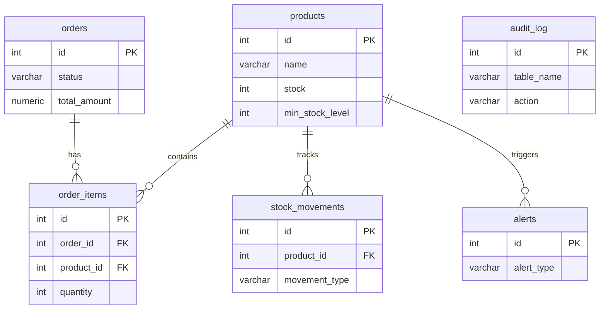

# PostgreSQL Trigger/View/SP

> **PostgreSQL'in gücünü keşfet — trigger, view, stored procedure ile Fat Database Mimari**


## 🎯 Özet

Bu proje, "Fat Database, Thin Application" mimarisini kullanarak geliştirilmiş gelişmiş bir envanter yönetimi backend sistemidir. İş mantığının büyük bir kısmı (stok düşme, uyarı mekanizmaları, trend analizi) Node.js uygulama katmanı yerine PostgreSQL içinde; Trigger'lar, View'lar, Stored Procedure'lar ve Window Function'lar kullanılarak çözülmüştür. Bu yaklaşım veri tutarlılığını artırır ve ACID garantilerini tam anlamıyla kullanır.

## ✨ Ana Özellikler

- ✅ **Trigger** — Sipariş eklendiğinde otomatik stok düşürme (`trg_deduct_stock`)
- ✅ **Trigger** — Kritik stok seviyesi uyarısı (`trg_check_low_stock`)
- ✅ **View** — Düşük stoklu ürünler raporu (`v_low_stock_products`)
- ✅ **View** — Günlük satış özetleri (`v_daily_sales_summary`)
- ✅ **Stored Procedure** — Atomik sipariş oluşturma, Row-level lock (`sp_create_order`)
- ✅ **Window Functions** — Son 30 günlük satış trendi, LAG, LEAD, RANK (`v_sales_trend_30days`)
- ✅ **Transaction Isolation** — SERIALIZABLE transaction demosu
- ✅ **Backend** — Hafif Node.js + Express REST API katmanı
- ✅ **Reporting** — Python ile PDF envanter raporu üretimi

## 🧰 Tech Stack

**Database:** `PostgreSQL 18`  
**App:** `Node.js + Express`  
**DB Client:** `node-postgres (pg)`  
**Scripting (Rapor):** `Python + reportlab + psycopg`  
**Admin UI:** `pgAdmin 4`  

## 🏗 Mimari
- Tüm veritabanı şeması ve iş mantığı `repo/migrations/` klasöründe SQL dosyaları olarak tutulmaktadır.
- Node.js uygulaması sadece HTTP isteklerini karşılar ve karmaşık işlemleri veritabanındaki fonksiyonlara devreder.

### Veritabanı İlişki Diyagramı (ERD)



## 🚀 Kurulum

### Gereksinimler
- PostgreSQL ≥ 15 (Projede 18 kullanılmıştır)
- Node.js ≥ 18
- Python 3 (Raporlama için)

### Adım Adım

```bash
# 1) Repo'yu klonla ve klasöre gir
git clone https://github.com/Nathanaelle25/final-p33-postgresql-trig.git
cd final-p33-postgresql-trig

# 2) Environment dosyası
cp repo/.env.example .env
# .env içindeki veritabanı parolasını kendi sisteminize göre güncelleyin.

# 3) Bağımlılıkları yükle (repo klasöründe)
cd repo
npm install

# 4) Veritabanını hazırla (Migration ve Seed)
npm run migrate

# 5) Sunucuyu Çalıştır
npm start
# Proje http://localhost:3000 portunda çalışacaktır.
```

## 📡 API Endpoints

| Method | URL | Description |
|--------|-----|-------------|
| GET | `/api/products?search=keyword` | Tüm ürünleri listele / Ara |
| POST | `/api/orders` | Yeni sipariş oluştur (Atomik SP çağrısı) |
| GET | `/api/reports/trend` | Son 30 günlük satış trendi (Window Functions) |
| GET | `/api/demo/isolation` | Isolation Level (Serializable) Demosu |

## 🤝 Katkı

Bu proje **BMU1208 Web Tabanlı Programlama** dersi kapsamında **Bitlis Eren Üniversitesi** — **Bilgisayar Mühendisliği** bölümünde bir final ödevi olarak geliştirilmiştir.

Ders yürütücüsü: **Dr. Öğr. Üyesi Davut ARI**

## 📜 Lisans

MIT © 2026 **Nathanaelle Bopti Ngah Bong** — Tam metin için [LICENSE](LICENSE).

## 🙋‍♂️ İletişim

- **Öğrenci:** Nathanaelle Bopti Ngah Bong
- **Öğrenci No:** 24080410150
- **E-posta:** ngahbongnathy@gmail.com
- **Ders:** BMU1208 · Web Tabanlı Programlama
- **Kurum:** Bitlis Eren Üniversitesi — Mühendislik-Mimarlık Fakültesi

---
<sub>🤖 Bu projede AI asistanları kullanılmıştır. Tüm mimari kararlar ve kullanım tercihleri öğrenci tarafından yapılmıştır.</sub>
